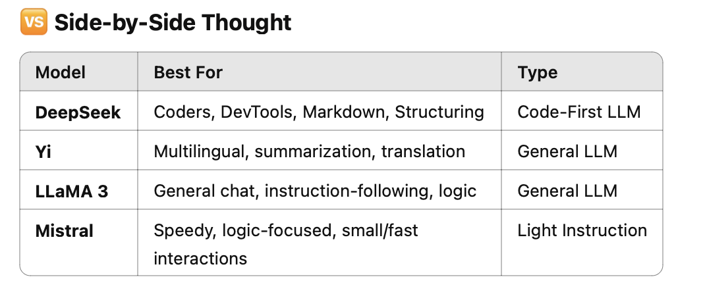

# german-subtitles-ai

# 🇩🇪 German Subtitle Simplifier App

**A personal language-learning companion that fetches subtitles from German news, simplifies them with AI, and extracts key vocabulary and grammar to help you grow — built with Python, love, and ambition.**

---

## ✨ What It Does So Far

This app connects to a subtitle XML file published alongside daily videos from [Tagesschau](https://www.tagesschau.de/), one of Germany's most prominent news channels.

## One-Click Desktop Launcher (macOS)

To streamline the development workflow, a macOS desktop shortcut was created using Automator. With a single click, it opens the terminal, activates the Conda environment, and runs the Streamlit app in the browser. This makes the tool feel like a native app while keeping all the benefits of a Python-based backend.

**The flow:**

1. 🔍 It parses the subtitle file by inspecting the network traffic from the Tagesschau website (auto-grabs latest XML).
2. 🧼 Cleans and extracts readable text from the XML structure.
3. ✨ Streamlit UI with model selection toggle (ChatGPT, DeepSeek or local LLM)
4. 🤖 Sends the cleaned German text to **ChatGPT** (via OpenAI API) using a carefully crafted prompt:
   - Downgrade the text to a **B2 level**.
   - Highlight important **vocabulary**.
   - Identify key **grammar structures**.
5. Possible prompt to inout a new selected request.
6. 🧠 Supports offline models like Mistral and LLaMA3.2 via Ollama. (So far the result of the models is not satisfactory)
7. 📄 Outputs the results with timestamp and model info (.txt or .docx).

---

## 🛠️ Built With

- Python 3
- `requests`, `re`, `docx`, `dotenv`
- OpenAI API (GPT-4o)
- DeepSeek (Online)
- Shell scripts (planned integration with Automator)

---

## Required Local Models (Ollama)

To run this app locally, install Ollama and pull the required models:

```bash
# Yi
ollama pull yi:6b

# Mistral
ollama pull mistral

# LLaMA 3
ollama pull llama3.2(Lite)
```

## 🖼️ Preview

Here’s a sneak peek of the UI in development:



It takes too much space for all models to co-exist so remember to run into:

```bash
ollama rm <model>
```

## 🚧 Roadmap: The Future of the App

I’m growing this tool step by step — here's what's coming next:

### ✅ Planned Features

- 🗃 **Database Integration**:
  - Save subtitle sessions, simplified texts, and vocabulary
  - Store and tag vocabulary in a PostgreSQL DB
- 🧪 **Interactive Vocabulary Tools**:
  - Select favorite words and auto-generate **quizzes** or **cloze exercises**
  - Optionally connect to image APIs for visual learning (e.g. German + English + image)
- 🔁 **Automation with Automator (macOS)**:
  - Schedule subtitle fetches and processing
  - Turn this into a daily language learning assistant

---

## 🎯 Why I Built It

I’m learning German — and as a developer, I wanted to **build the tools I need to learn better**.  
What started as a personal helper has become a showcase of:

- 🛠 API integration (OpenAI, DeepSeek)
- ⚙️ Automation and scripting
- 🧠 NLP-assisted simplification
- 🧩 Future-ready app design and project ownership

This project is also part of my path toward becoming a **Solutions Architect** focused on **AI, automation, and cloud-based systems**.

---

Then run the app normally using:

```bash
python app/main.py

💡 Contributing / Feedback

This is a solo project — but ideas, feedback, or kind encouragements are always welcome.
Reach me at: alexandros.samartzisport@gmail.com

⸻

📚 License

MIT License – open, free, and made to be shared.

⸻

🙌 Personal Note

This project is part of my developer portfolio — but more than that, it’s my language learning partner, and a representation of how I solve problems by combining curiosity, technology, and automation.

Disclaimer: I’ve also been using tools like ChatGPT as a support for development, planning, and language — not just as a code assistant, but as a way to clarify ideas and move faster
```
